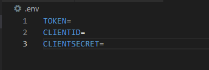

# Discord Cat Bot 😺


## Table of Contents 📝
- [What is this ❓](#what-is-this-question)
- [Showcase 📺](#showcase-tv)
- [Dependencies 📃](#dependencies-page_with_curl)
- [How to Setup ℹ️](#how-to-setup-information_source)
- [Commands ⌨️](#commands-keyboard)

##  What is this :question:

This bot fetches the top 100 posts from [r/cats](https://www.reddit.com/r/cats/) and randomly selects one of them to post in the specified channel. The posts are fetched using the Python library [praw](https://pypi.org/project/praw/) which allows the bot to easily fetch the posts.

If you encounter any problems with the bot please make an issue [here](https://github.com/JugieNoob/Discord-Cat-Bot/issues) and i will try my best to solve them.

# Showcase :tv:
### 1. The Cat Bot displaying the post.


## Dependencies :page_with_curl:
- [discord.py](https://discordpy.readthedocs.io/en/stable/)
- [pythondotenv](https://pypi.org/project/python-dotenv/)
- [praw](https://pypi.org/project/praw/)

❗To install the dependencies type ``pip install -r requirements.txt`` into a terminal window. ❗

## How to Setup :information_source:

1. Download the dependencies using the ```requirements.txt``` file.

<br>
2. Create a ``.env`` file in the project folder and copy the following lines into it as shown in the screenshot below.
    ```
    TOKEN=
    CLIENTID=
    CLIENTSECRET=
    ```
    
    <br>
    <br>

3. Create a Reddit application and copy the Client ID and Client Secret into the ```.env``` file. If you do not know how to do this, please follow [this](https://support.heateor.com/get-reddit-client-id-and-secret/) link that will show you how to create a Reddit application and get the required fields.
<br>
4. Start the bot by typing ```python main.py``` into a terminal instance.


## Commands :keyboard:

Command|Description
-|-
.cat | Sends a random cat image from [r/cats](https://www.reddit.com/r/cats/) 
